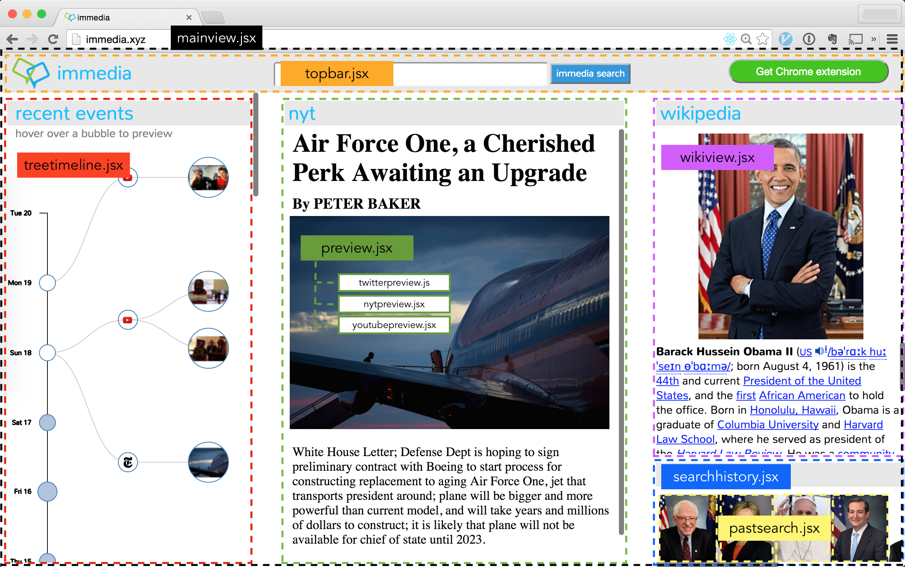
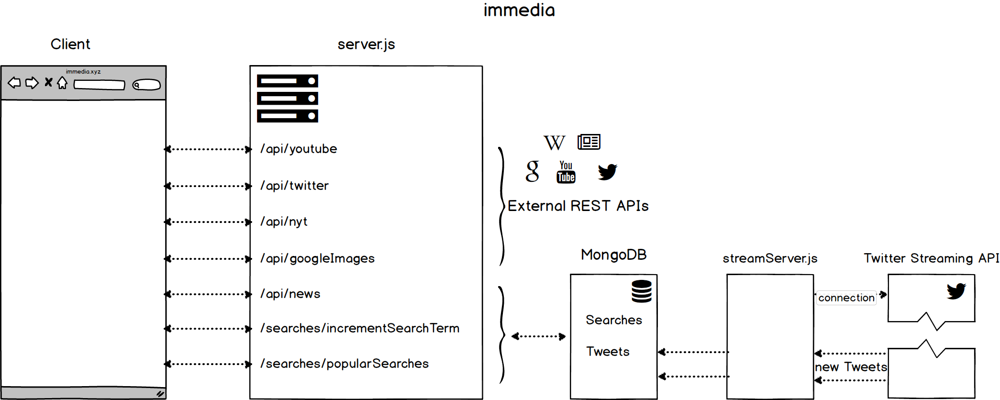

# immedia

immedia is a real-time news and social media aggregator for Wikipedia. It is available on the web at [immedia.xyz](http://immedia.xyz) or via a Google Chrome browser extension from the [Google Chrome Store](http://bit.ly/1GjqyVh).

## Summary
Wikipedia is the sixth most-visited website in the United States [1], undoubtedly because of the quick answers it can provide the casual web surfer. However, it's often incomplete.

In a world where financial markets can turn on less than 140 characters, or the newest video superstar is born overnight, a need exists for a resource that combines mankind's cumulative knowledge with the immediacy of the real world.  That's the main reason we created immedia.

An immedia search aggregates relevant news articles from sources like the New York Times and the Economist, popular videos uploaded to YouTube, and important Tweets all within the last 30 days, while still providing the high-level context of Wikipedia.

For those familiar with Wikipedia, the immedia timeline can be embedded directly into a corresponding Wikipedia article to provide seamless content discovery.

We invite you to get started on your next exploration at [immedia.xyz](http://immedia.xyz) or via our Chrome extension.

immedia, your real-time encyclopedia

## Architecture

### Front-end

### Back-end

## Contributing

1. Fork repo
2. Create feature branch: `git checkout -b new-feature`
3. Install node modules in project root: `npm install`
4. Add API keys to server/keys.js
5. Start MongoDB: `mongod`
6. Commit changes: `git add <files> && git commit -m "[feature] (client/server) add new feature"`
7. Lint, minify code: `gulp production`
8. Push to fork: `git push origin new-feature`
9. Submit a pull request to upstream repo

## Authors

* Joel Dado
* OJ Haugen
* Uchechukwu Nnadi
* Jackson Sierra
* Ryan Smith

## Sources
[1] 'Top Sites in United States.' Alexa, an Amazon Company, 2015. http://www.alexa.com/topsites/countries/US

## License

MIT
